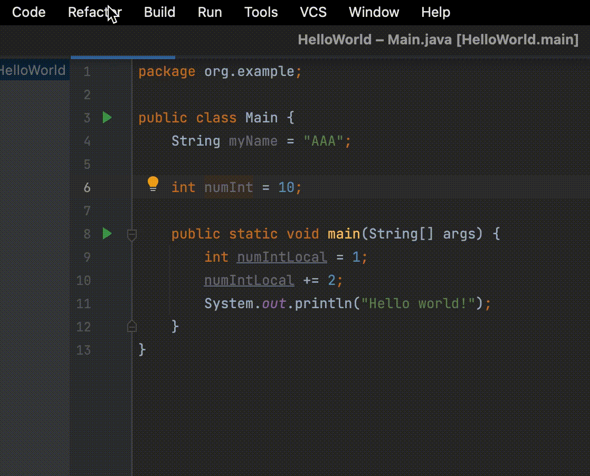
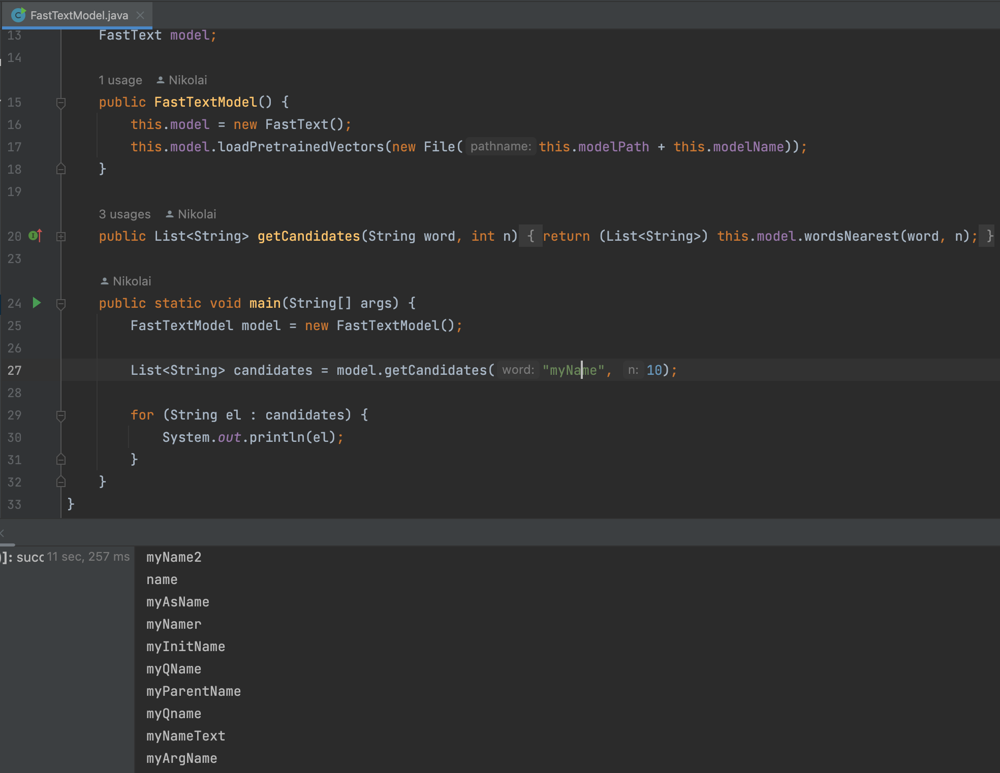

# ML_in_IDE_Plugin

## Plugin example

Below is an example of how the plugin works
using a [`SimpleModel`](src/main/java/org/intellij/sdk/model/impl/SimpleModel.java) 
that offers five default candidates.

 

When running the plugin using the [`FastTextModel`](src/main/java/org/intellij/sdk/model/impl/FastTextModel.java), 
an error occurs that I have not been able to fix at the moment. 
Below is a screenshot that shows that I was able to load 
the pretrained `FastTextModel` into the Java project.

 

## Pretrained FastText model

Locate pretrained `FastText` model in this [folder](src/main/resources/model).
You can download `.vec` file [here](https://disk.yandex.ru/d/o-H6XphFQGPUqQ).